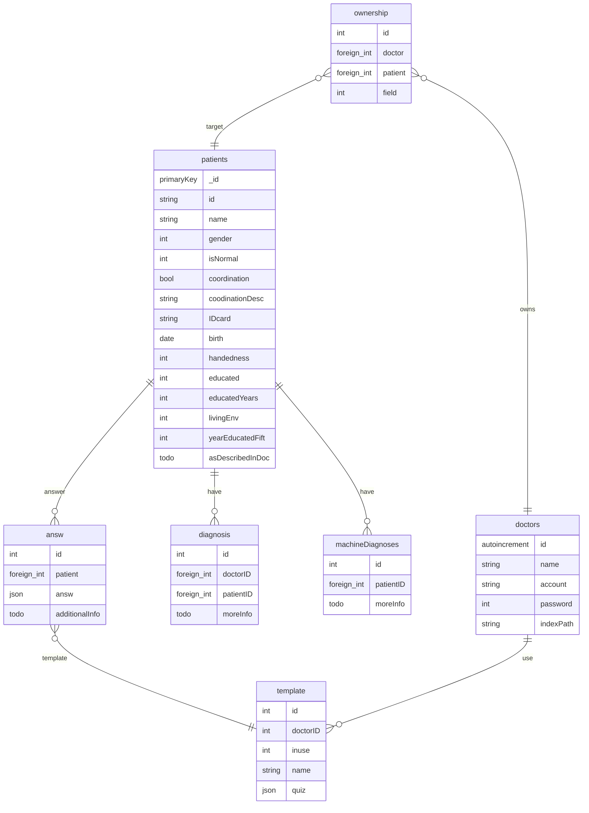

# ERD 图


<!-- ## 问卷部分

```mermaid
erDiagram

``` -->

<!-- ```mermaid
erDiagram

quizTemplate{
    autoincrement id
    foreign_int doctorID
    string name
}

quizResult{
    autoincrement id
    foreign_int patientID
    foreign_int doctorID
    todo aboutResult
}

fillQuiz{
    autoincrement id
    foreign_int templateID
    string desc
}

fillAnsw{
    autoincrement id
    string desc
    string answ
}

choiceQuiz{
    autoincrement id
    foreign_int templateID
    string desc
    int type
    string choices
}

choiceAnsw{
    autoincrement id
    string desc
    string choices
    int answ
}

fillChoiceAnsw{
    autoincrement id
    string desc
}


``` -->